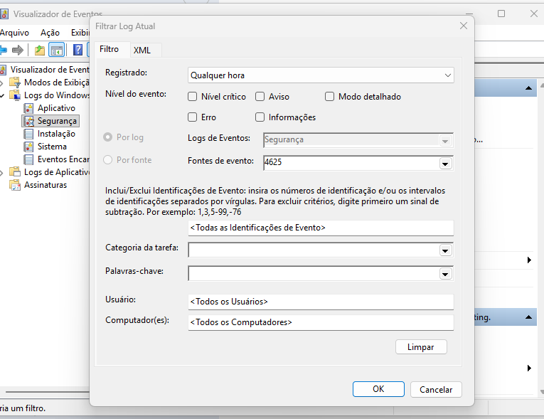
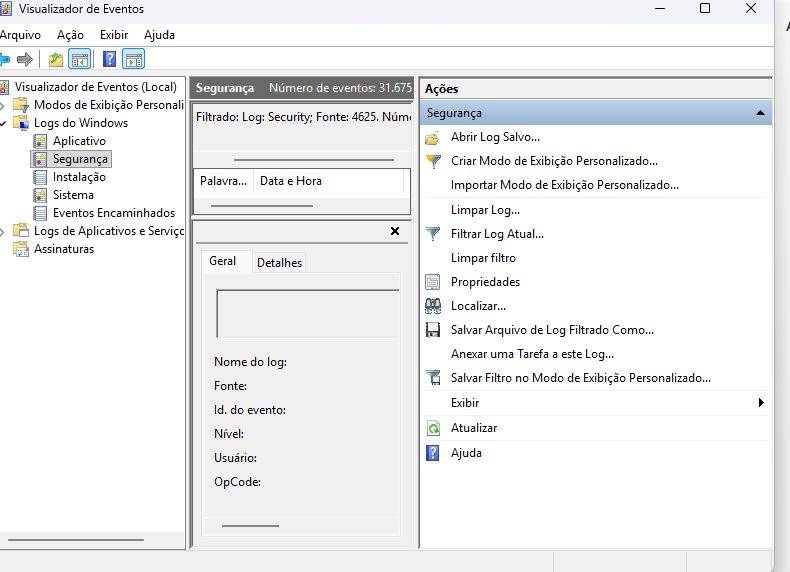
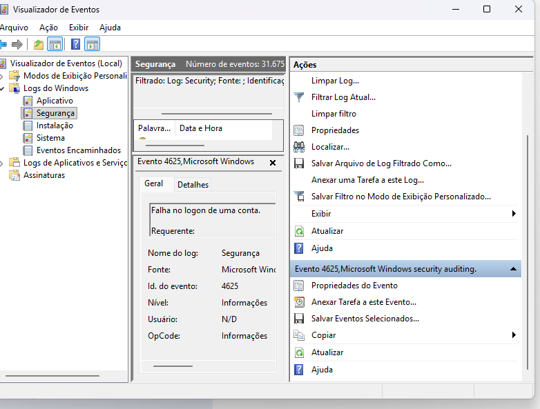
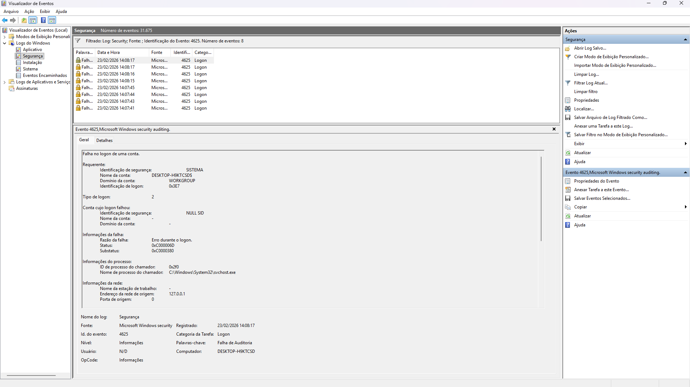

# Detecção de Tentativas de Login Inválidas (Event ID 4625) 🛡️

## 1. Objetivo
Simular e identificar tentativas de acesso não autorizado em ambiente Windows, analisando logs de segurança para entender padrões de ataques como Brute Force ou acessos indevidos.

## 2. Tecnologias Utilizadas
- **Sistema Operacional:** Windows 11
- **Ferramentas de Auditoria:** Política de Segurança Local (secpol.msc)
- **Análise de Logs:** Visualizador de Eventos (Event Viewer)

## 3. Metodologia
1. **Configuração:** Ativação da auditoria de falhas de logon nas Políticas Locais.
2. **Simulação:** Geração de múltiplos eventos de falha através de tentativas de login incorretas.
3. **Filtragem:** Utilização do Event Viewer para isolar o Event ID 4625.
4. **Análise Técnica:** Inspeção dos campos críticos (Account Name, Logon Type e Source IP).

## 4. Evidências do Laboratório

### 4.1 Ativação da Auditoria

### 4.2 Filtro no Event Viewer

### 4.3 Lista de Eventos Detectados

### 4.4 Análise Detalhada (Status e Tipo de Logon)

## 5. Mentalidade de SOC & Conclusão
Como analista de Blue Team, identifiquei eventos de **Tipo de Logon 2** (Interativo). Em um cenário real, o monitoramento de picos desses eventos permite a detecção de ataques de força bruta, disparando playbooks de resposta a incidentes para contenção da ameaça.

## 6. Evoluções Futuras
- Integração dos logs com um SIEM (Splunk ou ELK Stack).
- Criação de alertas automáticos via PowerShell para picos de falhas de login.
